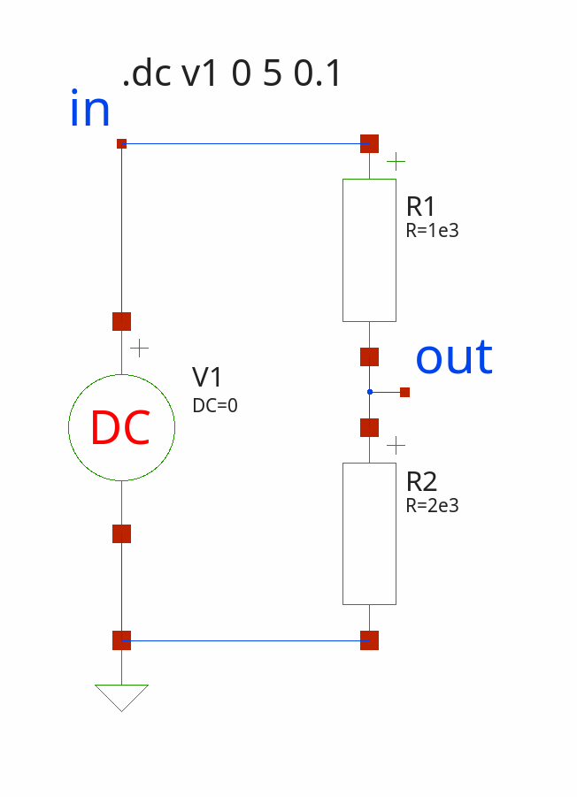
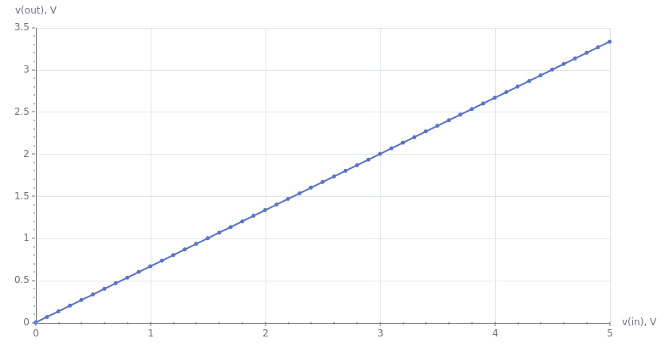

This package provides Tcl interface to different SPICE and SPICE-like simulator, Ngspice, Xyce.
It was inspired by [PySpice](https://github.com/PySpice-org/PySpice) project, object-oriented interface to
SPICE-like simulators written in Python.


## General concept
The general concept of the package is to build a netlist using Tcl scripts. It is based on the TclOO
object-oriented system, where everything is represented by objects, including elements, models, analyses,
waveforms, and netlists. After defining the netlist, you can run the simulation, read the resulting data, and then
process or display the data using the Tcl scripting language.

This approach differs from the [Tclspice](https://ngspice.sourceforge.io/tclspice.html) extension, which comes
bundled with Ngspice and is tightly bound to the simulator's internal structures. SpiceGenTcl offers a more
flexible approach that can be extended to work with different simulators that use netlists with similar syntax.

## Usage examples
SpiceGenTcl can be used if you need:
- automate some repetitive simulation tasks, and you don't like
  [Nutmeg](https://ngspice.sourceforge.io/ngspice-control-language-tutorial.html) syntax (SPICE standard scripting
  language)
- postprocess output waveforms and data
- change netlist structure on the fly
- simulate different models in the same circuit setup
- run circuit optimization with parameters variations as well as variations in circuit topology

## Installing
You have two ways: install from git repo (convinient for Linux users) or from archive package release.

### From git repo
Run following commands:
- `git clone https://github.com/georgtree/SpiceGenTcl.git`
- `./configure`
- `sudo make install`

During installing it installs manpages, and local html documentation in `/usr/local/share/SpiceGenTcl/doc`.

For test package in place run `make test`.

For package uninstall run `sudo make uninstall`.

### From archive
To install the package you should extract archive with source code and add path of the package folder to `auto_path`
variable:
```tcl
lappend auto_path "path to SpiceGenTcl package"
```

## Dependencies
Package is written in pure Tcl with relying on Tcllib and ticklecharts, tcl version is 9.0. The only necessary
external dependency is the simulator itself.

- [Ngspice](https://ngspice.sourceforge.io/download.html)
- [Xyce](https://xyce.sandia.gov/downloads/executables/)
- [Tcllib](https://www.tcl.tk/software/tcllib/)
- [ticklecharts](https://github.com/nico-robert/ticklecharts)

After simulator installation add path to executable to `PATH` environment variable.

For code coverage test [nagelfar](https://nagelfar.sourceforge.net/) is used, commit 845924 of master branch.

For view test coverage diffs [eskil](http://eskil.tcl.tk/index.html/doc/trunk/htdocs/index.html) is used.

## Documentation and tutorials

Documentation could be found [here](https://georgtree.github.io/SpiceGenTcl/). 

Tutorials describing different examples could be found [here](https://georgtree.github.io/SpiceGenTcl/index-Tutorials.html).

Good tutorial for Tcl language could be found [here](http://tcl.tk/man/tcltutorial/html/tcltutorial.html)

Documentation was generated with [ruff!](https://ruff.magicsplat.com/).

Tcl syntax highlightning was done with [hl_tcl](https://github.com/aplsimple/hl_tcl).

## Supported platforms

I personally use Kubuntu 24.04, and I also tested package on Windows 11. 
On Kubuntu I use Tcl/Tk 9.0 compiled from sources, as well as Ngspice and Xyce.
On Windows I use [Magicsplat](https://www.magicsplat.com/tcl-installer/) distribution of Tcl/Tk 9.0. For
Ngspice and Xyce I use precompilled binaries.

<font color="red">**Note**</font>: on Windows by default Ngspice save raw file into ascii format, to pass all tests
(because of different numbers formatting - scientific by default) you need to set binary format by default in .spiceinit
by this line:
```spice
set filetype=binary
```

Tcl is a cross-platform language, and because this package is written in pure Tcl, 
you can practically run it on any platform, including Windows, Linux (all flavors), and FreeBSD. 
Ngspice is available as pre-compiled binaries for Linux and Windows, but it can also be compiled on FreeBSD.
Xyce is availible as pre-compiled for Windows, RHEL and MacOS, but can be compiled to any other platform.

## Quick start

- <font color="red"> **Important note 1**</font>: internally, all device names, parameters, nodes, types, 
reference names, and data vector's names are converted to lowercase after object instantiation. While you can enter
them in any case, they can only be accessed by their lowercase names. This approach aligns with the fact that most
SPICE simulators are case-insensitive. To prevent ambiguity in Tcl code, where the simulator treats mixed-case
names as identical, we convert everything to lowercase. This ensures that we can detect and resolve any duplicate
names in the top-level circuit before generating the netlist.
- <font color="red"> **Important note 2**</font>: this package is not designed to be used with the `.control`
section in Ngspice, the .step statement in LTspice, or multiple DC sweeps, and it does not support reading
parametric sweeps from raw data. The idea of the package is to handle all such tasks within a Tcl script, 
eliminating the need to use the simulator's internal scripting capabilities, and dependence on each simulator
unique ways of handling parametric sweeps, that compromises compatibility. But it is could be done easily in
principle to realize special objects and reading of raw files with parametric sweeps.
- <font color="red"> **Important note 3**</font>: in this package the following aliases for commands are defined:
```tcl
interp alias {} dget {} dict get
interp alias {} @ {} lindex
interp alias {} = {} expr
interp alias {} dexist {} dict exists
interp alias {} dcreate {} dict create
interp alias {} dset {} dict set
```
- <font color="red"> **Important note 4**</font>: source code follows the pattern, if method or variable name
of the class starts from capital letter, it is intended to be private and not directly accessible from outside the 
object. Even if variable defined as a `property` (you can access it with `configure` method) and start from capital 
letter, it is better to not try to access it directly.
### Packages imports

The first step is import of package:
```tcl
package require SpiceGenTcl
```
Import all commands from ::SpiceGenTcl:
```tcl
namespace import ::SpiceGenTcl::*
```
One of the commands is [::SpiceGenTcl::importNgspice]. By calling this command, we can import all commands related
to the Ngspice simulator, eliminating the need to add the `::SpiceGenTcl::Ngspice` prefix before any command. 
Here's how to do it:
```tcl
importNgspice
```
To plot results of simulation we also import package `ticklecharts`:
```tcl
package require ticklecharts
```

### Circuit definition

Let's try to define simple resistor divider circuit with following netlist:
```
voltage divider netlist
v1 in 0 1
r1 in out 1e3
r2 out 0 2e3
.dc v1 0 5 0.1
```



First step is creating circuit object:
```tcl
set circuit [Circuit new {voltage divider netlist}]
```
The `Circuit` command creates a new object of the [::SpiceGenTcl::Circuit] class, which is imported from the 
`::SpiceGenTcl` namespace and represents the top-level circuit. 
The only argument we provide is the name of the circuit, which will be printed on the first line of the netlist.

The next step is building netlist by addding elements to top circuit object:
```tcl
$circuit add [Vdc new 1 in 0 -dc 1]
$circuit add [R new 1 in out -r 1e3]
$circuit add [R new 2 out 0 -r 2e3]
$circuit add [Dc new -src v1 -start 0 -stop 5 -incr 0.1]
```
An instance of the [::SpiceGenTcl::Circuit] class, referenced by the `circuit` variable, has an
[::SpiceGenTcl::Circuit::add] method that appends the references of argument objects to it. The object-creating
commands `Vdc`, `R`, and `Dc` — which represent a DC voltage source, a basic resistor, and a DC analysis,
respectively — are imported from the `::SpiceGenTcl::Ngspice::Sources`, `::SpiceGenTcl::Ngspice::BasicElements`, 
and `::SpiceGenTcl::Ngspice::Analyses` namespaces.

When using the `new` subcommand, you provide the basic arguments for the element. For example, in the `R` command,
you would supply the name '1', the name of the net connected to the positive node 'in', the name of the net
connected to the negative node '0' (which is the global ground), and the resistance value '1e3'.

The last necessary step is to create [::SpiceGenTcl::Simulator] object with command `Batch` from
`::SpiceGenTcl::Ngspice` namespace and attach it to [::SpiceGenTcl::Circuit] object:
```tcl
set simulator [Batch new {batch1} {/usr/local/bin/}]
$circuit configure -Simulator $simulator
```
Now we are ready to run simulation:
```tcl
$circuit runAndRead
```
After the simulation, we can read the resulting data. We use the [::SpiceGenTcl::Circuit::getDataDict] method to
obtain a dictionary where the keys are the names of the result vectors:
```tcl
set data [$circuit getDataDict]
```
The we can get vectors v(in) and v(out) from dictionary `data`:
```tcl
set axis [dict get $data v(in)]
set trace [dict get $data v(out)]
```

### Plotting data

To plot results we use [`ticklecharts`](https://github.com/nico-robert/ticklecharts) package:
```tcl
foreach x $axis y $trace {
    set x [format "%.3f" $x]
    set y [format "%.3f" $y]
    lappend xydata [list $x $y]
}
set chart [ticklecharts::chart new]
$chart Xaxis -name "v(in), V" -minorTick {show "True"} -min 0 -max 5 -type "value" -splitLine {show "True"}
$chart Yaxis -name "v(out), V" -minorTick {show "True"} -min 0 -max 3.5 -type "value" -splitLine {show "True"}
$chart SetOptions -title {} -tooltip {} -animation "False"
$chart Add "lineSeries" -data $xydata -showAllSymbol "nothing"
set fbasename [file rootname [file tail [info script]]]
$chart Render -outfile [file normalize [file join html_charts $fbasename.html]]
```
To view result, we should open rendered resistor_divider.html chart in browser.



